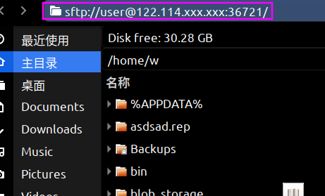

# javaSftpserver
Native cross-platform ssh/sftp server compiled with graalvm, only 6m in size.(If it works for you, please give me a star >_<)


## use
Use commands to execute files on the machine to be managed.

args:   user passMd5  host port
```bash
iptables -A INPUT -p tcp --dport   36721 -j ACCEPT #If your machine is linux, you need to open the port for connection
./javaSftp-1.0-SNAPSHOT_UPX  test e10adc3949ba59abbe56e057f20f883e 122.114.xxx.xxx  36721  #user=test pass=123456 (e10adc3949ba59abbe56e057f20f883e)
```

Then you can connect in the file manager under linux/windows

-  linux
 nautilus 


- windows: You need some software such as WinSCP

##  issue
-  Unable to connect to sftp server
You can execute ssh user@host -p port first to try to connect to the target ssh service，If your sftp server was restarted , a new key will be generated in the client's ~/.ssh directory.Try to delete the key information in the known_hosts file,Reconnect afterwards
```bash
xxx@xxxx~> ssh test@122.114.xxx.xxx -p 36721                                                                                                                                                                    14:17:09
@@@@@@@@@@@@@@@@@@@@@@@@@@@@@@@@@@@@@@@@@@@@@@@@@@@@@@@@@@@
@    WARNING: REMOTE HOST IDENTIFICATION HAS CHANGED!     @
@@@@@@@@@@@@@@@@@@@@@@@@@@@@@@@@@@@@@@@@@@@@@@@@@@@@@@@@@@@
IT IS POSSIBLE THAT SOMEONE IS DOING SOMETHING NASTY!
Someone could be eavesdropping on you right now (man-in-the-middle attack)!
It is also possible that a host key has just been changed.
The fingerprint for the ECDSA key sent by the remote host is
SHA256:mwYLNeXGp6svf9pJ8z98QWzghWbBE4rm0Sfhcs1QdpE.
Please contact your system administrator.
Add correct host key in /home/xxx/.ssh/known_hosts to get rid of this message.
Offending ECDSA key in /home/xxx/.ssh/known_hosts:1
  remove with:
  ssh-keygen -f "/home/xxx/.ssh/known_hosts" -R "[122.114.xxx.xxx]:36721"
ECDSA host key for [122.114.xxx.xxx]:36721 has changed and you have requested strict checking.
Host key verification failed.
```


##  build
git cone this project , and open with IDE .After waiting for maven to compile the classes that can be compiled.

### jar
Because there are some symbol errors that require other dependencies, they will increase the size of the binary executable file. So I chose not to fix them (does not affect basic functions)

```bash
cd  javaSftpserver
 mvn assembly:attached -f "pom.xml"  #They will output all class files to the target folder
``` 
Will generate a jar in directory target


### native image

#### linux
```bash
cd  javaSftpserver
./build.sh
```
In order to successfully perform native compilation, I dealt with the log dependency of Apache SSHD's SLFJ. Pre-compilation configuration and optimization have been carried out.You can execute build.sh to compile after installing graalvm.When I perform upx compression, the output file size is reduced to 6m.

#### windows

In theory, it supports windows, you need to download the windows version of graalvm and install navtive-image. And replace the navtive-image path in build.sh, enter in the console

```bash
[your mvn path] assembly:attached -f "pom.xml"
[your native-image path]    --no-fallback   -H:+ReportExceptionStackTraces  --no-server   --initialize-at-build-time   --allow-incomplete-classpath     -H:DynamicProxyConfigurationFiles=proxyClass.json --enable-all-security-services   -H:ReflectionConfigurationFiles=reflectionConfig.json      --pgo    -jar target/javaSftp-1.0-SNAPSHOT.jar

```

# 中文
这是一个java实现的跨平台的ssh/sftp服务器,使用graalvm原生编译为二进制镜像,只有6m.我一般用来管理docker文件和远程vps文件。已经在linux  ubuntu18  x64上进行了编译和测试(支持文件/夹 删除/创建/修改/复制/移动 等).如果它对你有用,请给我一个星星>_<

为了成功的进行原生编译,我处理了Apache SSHD的SLFJ的日志依赖。已经进行了提前的编译配置和PGO优化,你可以在安装graalvm后执行build.sh进行编译,当我进行了upx压缩之后,输出文件体积降低到了6m.关于如何编译,见英文上文.
